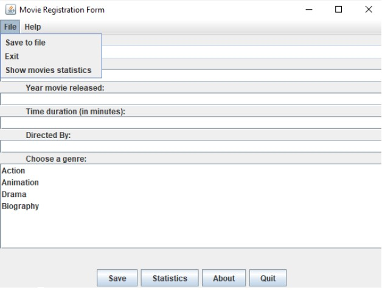
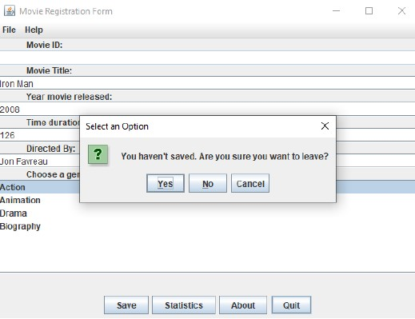
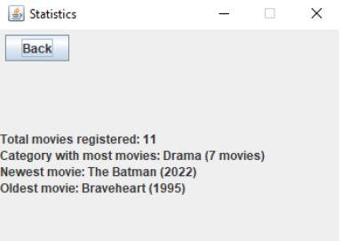

# Movie Registration App

<div style="display: flex;flex-direction:row;flex-wrap: wrap; justify-content: center; align-items: center; gap: 15px;  max-width: 1400px; margin: 0 auto;padding: 20px 10px;">
    
    
       
    
</div>

## Overview

The Movie Registration App is a Java Swing GUI desktop application built with NetBeans Ant that was created as part of my university coursework. 

## Features

- Register movies with details including name, release year, duration, director, and category.
- Organize movies into genre-specific files.
- Provides statistics about registered movies.
- Displays information about the application.
- Quit button for closing the application.

## Prerequisites

Before you begin, ensure you have met the following requirements:

- Java Development Kit (JDK) installed (recommended version: java 17.0.1).
- Apache NetBeans IDE installed for development.
  
## Installation

1. Clone this repository to your local machine:

   ```bash
   git clone https://github.com/MelinaMoraiti/Movie-Registration-App-Java-Swing.git
   ```
2. Open the project in NetBeans.

3. Build the project using NetBeans (Java With Ant).

4. The executable JAR file will be created in the dist directory.

   Run the application using the following command:

    ```bash
    java -jar dist/MovieRegistrationApp.jar
    ```

For any issues or questions related to the application, please feel free to create an issue.
